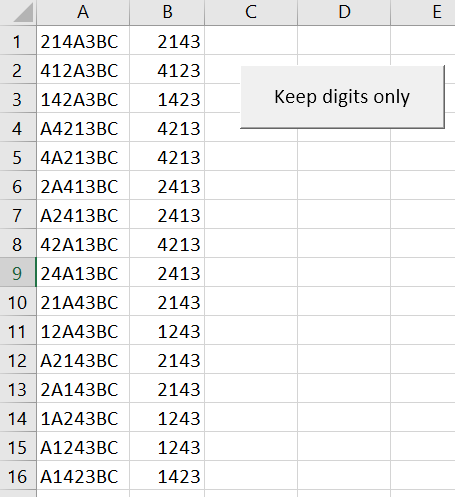

# Excel tips

> A few Excel tips

* [InversedVLookup](#inversedvlookup)
* [Regular expressions](#regular-expressions)
  * [Check ABCD i.e. a four letters code](#check-abcd-ie-a-four-letters-code)
  * [Keep only digits](#keep-only-digits)
* [License](#license)

## InversedVLookup

Search on the second column of a range and return the value in the first column (or any column). The native `VLookup` formula is designed to only search on the first column.

[Read more](./src/InversedVLookup/readme.md)

## Regular expressions

### Check ABCD i.e. a four letters code

Check the validity of a code: only permutations of a given range of letters are allowed. The example use `A`, `B`, `C` and `D` but you can of course choice your own.

[Read more](./src/RegularExpressions/checkABCD.md)

### Keep only digits

From a string, remove everything that isn't a digit. 

[Read more](./src/RegularExpressions/keepDigitsOnly.md)

## License

[MIT](LICENSE)
