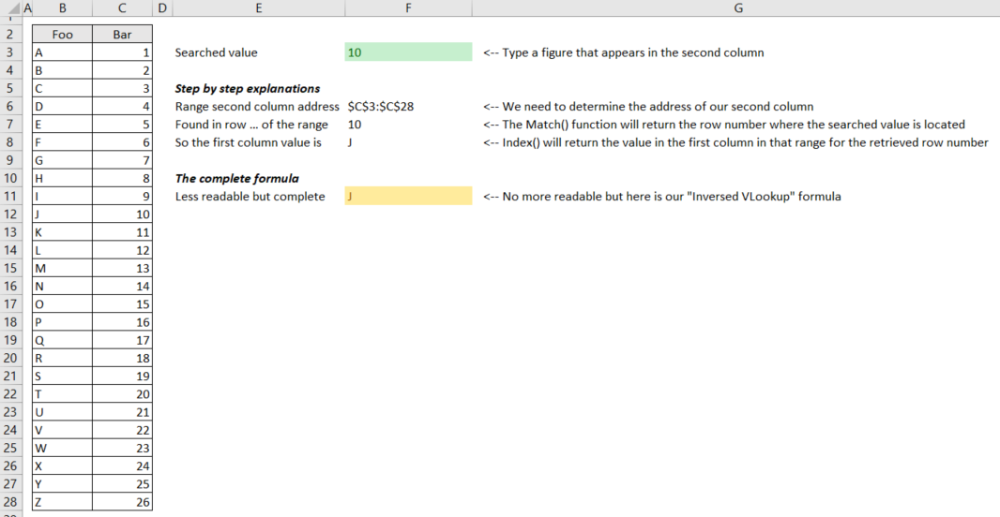

# Inversed VLookup

> Search on the second column of a range and return the value in the first column (or any column). The native `VLookup` formula is designed to only search on the first column.

The standard `VLookup` formula will search for a matching in the first column of a range (our data range) and will allow you to retrieve a value in any column (first, second, ...) but what if you need to use the same data range and search on the second column; not the first.

`VLookup` can't do this. We can do `=VLookup('C', $A$3:$B$9, 2, false)` (retrieve in the first column the value `C` and, for that line, return the second column) to get the value `3`. But we can't retrieve the value of `C` by searching on `3`. A formula like `=VLookup('C', $B$3:$A$9, 1, false)` is impossible; the range `$B$3:$A$9` is wrong. 

| Foo | Bar |
| --- | --- |
| A   | 1   |
| B   | 2   |
| C   | 3   |
| D   | 4   |
| E   | 5   |
| F   | 6   |
| G   | 7   |

The [InversedVLookup.xlsx](./files/InversedVLookup.xlsx) demo comes with a formula that make this possible.

This demo show how to do this; step by step or in a single (long) formula.

The final formula is : `=INDEX(data;MATCH($F$3;INDIRECT(ADDRESS(ROW(data);COLUMN(data)+1)&":"&ADDRESS(ROW(data)+ROWS(data)-1;COLUMN(data)+COLUMNS(data)-1));0);1)`

where `data` is the name given to the range `$B$3:$C$28`.
