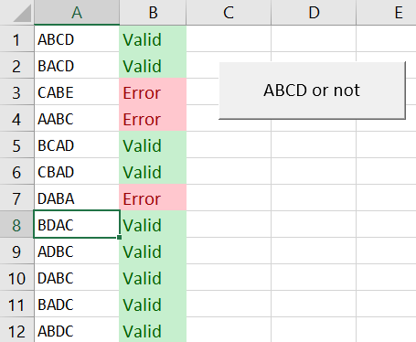

# Regex to verify permutations, code of four letters.

The idea is to validate an input sheet where the user should fill in a cell with a specific codification:

* Only four letters can be used: `A`, `B`, `C` or `D` (you can of course decide your owns values),
* The code isn't mandatory but if filled in, letters can be used once (`ABB` isn't allowed; `B` can't be used twice),
* The code can be one, two, three of four letters; not more

All the permutations below are allowed:

* Four letters: `ABCD`, `BACD`, `CABD`, `ACBD`, `BCAD`, `CBAD`, `DBAC`, `BDAC`, `ADBC`, `DABC`, `BADC`, `ABDC`, `ACDB`, `CADB`, `DACB`, `ADCB`, `CDAB`, `DCAB`, `DCBA`, `CDBA`, `BDCA`, `DBCA`, `CBDA`, `BCDA`
* Three letters: `ACD`, `ACB`, `ADC`, `ADB`, `ABC`, `ABD`, `CAD`, `CAB`, `CDA`, `CDB`, `CBA`, `CBD`, `DAC`, `DAB`, `DCA`, `DCB`, `DBA`, `DBC`, `BAC`, `BAD`, `BCA`, `BCD`, `BDA`, `BDC`
* Two letters: `AC`, `AD`, `AB`, `CA`, `CD`, `CB`, `DA`, `DC`, `DB`, `BA`, `BC`, `BD`
* One letter: `A`, `B`, `C` and `D`

Every else is incorrect.



The image here above show that

* `CABE` is invalid because `E` isn't allowed
* `AABC` is invalid because `A` is used twice
* `DABA` is invalid for the same reason.

## Regex

The regex is `/^(?:([abcd])(?!.*\1)){1,}$/gmi`, you can check it here: [https://regex101.com/r/8pBQYs/1](https://regex101.com/r/8pBQYs/1)

The code `{1,}` means at least one letter. If you want that the code should have at least 3 characters use `{3,}`. In that case, only  permutations using 3 or 4 letters will be valid

## VBA Code

```vbnet
Public Function checkABCD(ByVal sValue As String) As Boolean

    Dim sPattern As String
    Dim objRegex As Object

    ' If an empty value is allowed, this check will return
    ' True in that case. Remove the If block when empty value
    ' is not allowed
    If (Trim(sValue) = "") Then
        checkABCD = True
        Exit Function
    End If

    Set objRegex = CreateObject("vbscript.regexp")

    ' replace "abcd" here above by your own codes
    '
    ' The code {1,} means at least one letter.
    ' If you want that the code should have at least 3 characters
    ' use {3,}. In that case, only permutations using 3 or 4 letters
    ' will be valid

    sPattern = "^(?:([abcd])(?!.*\1)){1,}$"

    With objRegex
        .Global = True
        .MultiLine = True
        .IgnoreCase = True
        .Pattern = sPattern
    End With

    checkABCD = objRegex.Test(sValue)

End Function
```

## Tips

* Get all permutations for a code: [https://www.free-online-calculator-use.com/combination-calculator.html](https://www.free-online-calculator-use.com/combination-calculator.html)
* Validate the regex here: [https://regex101.com/r/8pBQYs/1](https://regex101.com/r/8pBQYs/1)
