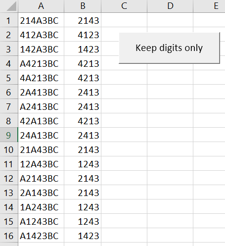

# Keeps only the numbers of a code

Remove everything from a given value except digits.



## Regex

The Regex is really simple: just match non digits `^\d` and replace occurrences by a null string.

## VBA Code

```vbnet
Public Function KeepDigitsOnly(ByVal sValue As String) As String

Dim objRegex As Object

    Set objRegex = CreateObject("vbscript.regexp")

    With objRegex
        .Global = True
        .MultiLine = True
        .IgnoreCase = True
        ' Match everything except a digit
        .Pattern = "[^\d+]"
    End With

    ' Replace matched characters by nothing
    KeepDigitsOnly = objRegex.Replace(sValue, vbNullString)

End Function
```

## Tips

* Get all permutations for a code: [https://www.free-online-calculator-use.com/combination-calculator.html](https://www.free-online-calculator-use.com/combination-calculator.html)
